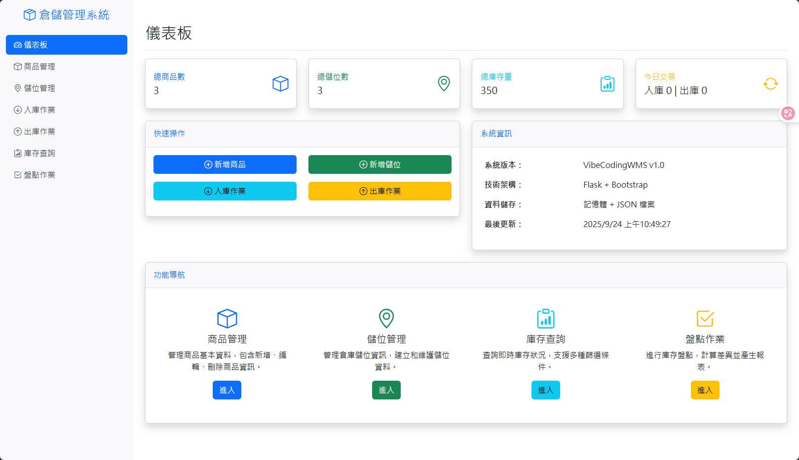

# VibeCodingWMS - 倉儲管理系統



這是一個基於 Flask 的倉儲管理系統（WMS），用於展示基本的倉儲管理功能。

## 功能特色

- 商品與儲位管理
- 入庫與出庫作業
- 庫存查詢與盤點
- 簡潔的網頁介面

## 安裝與執行

1. 安裝依賴套件：
```bash
pip install -r requirements.txt
```

2. 執行應用程式：
```bash
python app.py
```

3. 開啟瀏覽器訪問：http://localhost:5000

## 技術架構

- 後端：Python Flask
- 前端：Jinja2 Templates + Bootstrap
- 資料儲存：記憶體資料結構 + JSON 檔案